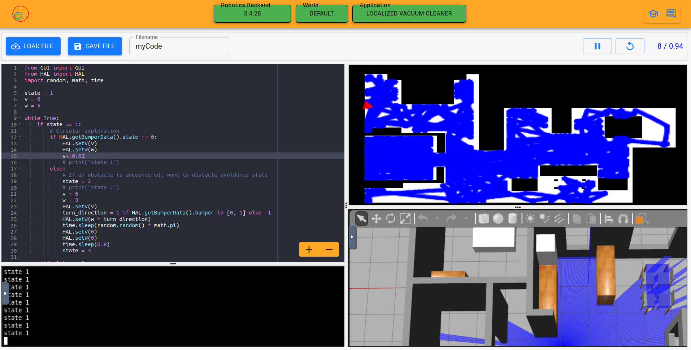

#  RoboMentor (jderobot-project11)
- video link: https://youtu.be/S0eC0nTPuS0
- python challenge: brownian.py
- robotics academy challenge: basic-vacuum-cleaner.py
- I have forked the robotics academy repo and I am currently working on the issue #2464 of the superthin template

## Basic vacuum cleaner
- I have worked with automous robotics and initially I wanted to implement an a star algorithm (refer to graph_search.js for an implementation I have done in javascript for another project) but I decided to go with the circular search algorithm as I was unable to convert the squares into the grids.
- The image below shows the 90% coverage achieved with my algorithm.

## Thanks for reviewing my application and I look forward to joining the jderobot team! 